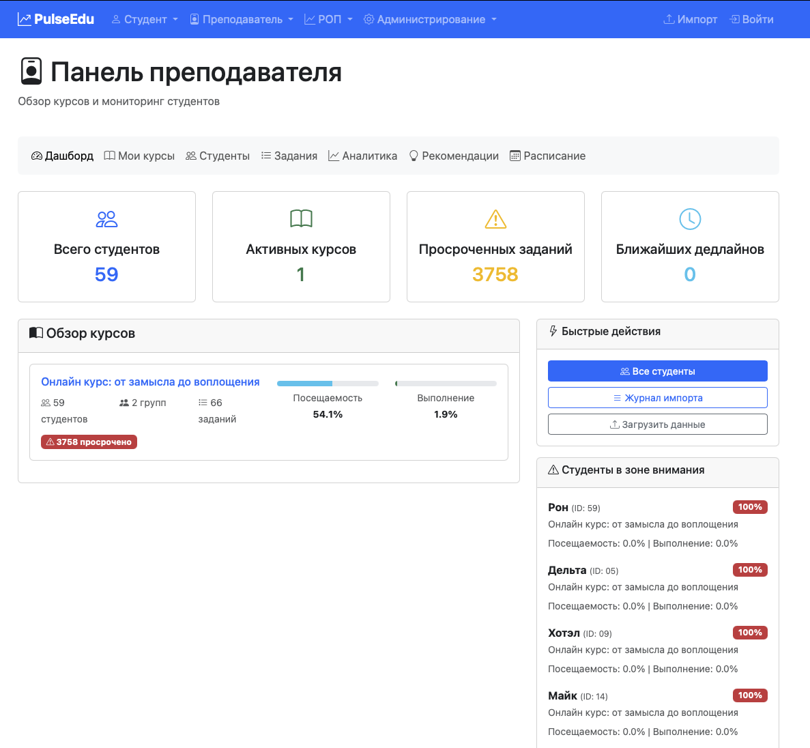
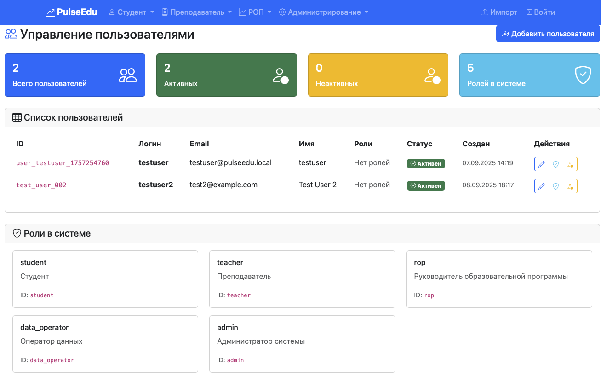
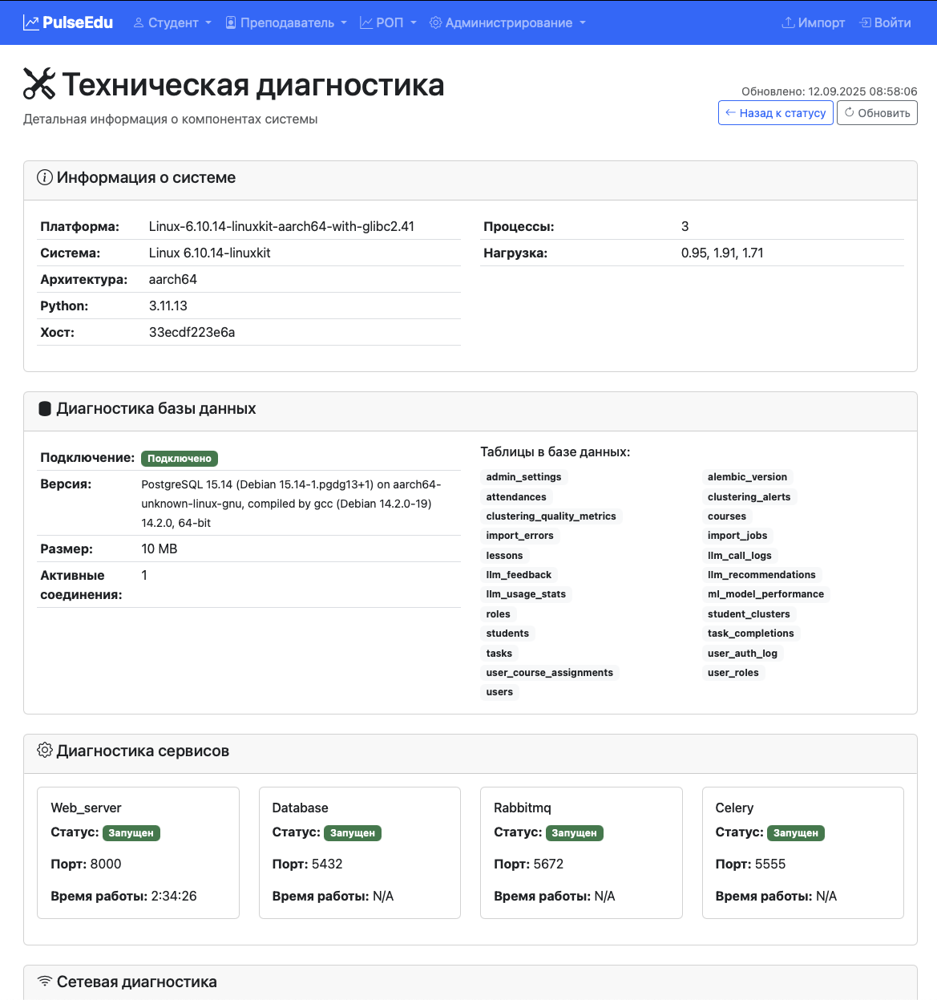

# Демонстрация интерфейса Pulse.EDU

Данный документ содержит скриншоты и описания всех основных разделов веб-интерфейса системы Pulse.EDU, организованные по логическим группам.

## Содержание

1. [Общий интерфейс](#общий-интерфейс)
2. [Личный кабинет студента](#личный-кабинет-студента)
3. [Личный кабинет преподавателя](#личный-кабинет-преподавателя)
4. [Личный кабинет РОП](#личный-кабинет-роп)
5. [Личный кабинет администратора](#личный-кабинет-администратора)

---

## Общий интерфейс

### Главный экран

**Описание функционала:**
- Точка входа в систему Pulse.EDU
- Предоставляет общую информацию о системе
- Навигация для различных типов пользователей
- Возможность входа в систему для авторизованных пользователей

---

## Личный кабинет студента

### Панель студента

**Описание функционала:**
- Обзорная панель с ключевыми метриками успеваемости
- Быстрый доступ к основным разделам
- Отображение текущего прогресса по курсам
- Уведомления и важная информация

### Мои курсы

**Описание функционала:**
- Список всех курсов, на которых зарегистрирован студент
- Информация о прогрессе по каждому курсу
- Быстрый переход к детальной информации по курсу
- Статусы выполнения и дедлайны

### Страница курса

**Описание функционала:**
- Детальная информация о конкретном курсе
- Список уроков и заданий
- Прогресс выполнения по курсу
- Доступ к материалам и ресурсам

### Прогресс по курсу

**Описание функционала:**
- Визуализация прогресса обучения
- Статистика по выполненным заданиям
- Графики и диаграммы успеваемости
- Сравнение с другими студентами (анонимно)

### Мои задания по курсу

**Описание функционала:**
- Список всех заданий по курсу
- Статусы выполнения (выполнено, в процессе, просрочено)
- Дедлайны и приоритеты заданий
- Возможность загрузки решений

### Расписание

**Описание функционала:**
- Календарное представление занятий
- Расписание лекций, семинаров и экзаменов
- Уведомления о предстоящих событиях
- Интеграция с личным календарем

### Персональные рекомендации

**Описание функционала:**
- ИИ-рекомендации для улучшения успеваемости
- Персональные советы по обучению
- Рекомендации по дополнительным материалам
- Анализ слабых и сильных сторон

---

## Личный кабинет преподавателя

### Панель преподавателя

**Описание функционала:**
- Обзорная панель с ключевыми метриками курсов
- Статистика по студентам и успеваемости
- Быстрый доступ к основным функциям
- Уведомления о важных событиях

### Успеваемость по курсу

**Описание функционала:**
- Общая статистика успеваемости по курсу
- Анализ прогресса студентов
- Выявление проблемных областей
- Сравнительный анализ результатов

### Кластеризация студентов

**Описание функционала:**
- ML-анализ для группировки студентов по уровням риска
- Визуализация кластеров (A, B, C группы)
- Детальная аналитика по каждой группе
- Рекомендации по работе с разными группами

### Общий прогресс

**Описание функционала:**
- Агрегированная статистика по всем студентам
- Тренды и динамика изменений
- Сравнение с предыдущими периодами
- Выявление общих проблем

### Мои студенты

**Описание функционала:**
- Полный список студентов с детальной информацией
- Фильтрация и сортировка по различным критериям
- Индивидуальные профили студентов
- Возможность отправки сообщений и уведомлений

### Задания по курсам

**Описание функционала:**
- Управление заданиями по всем курсам
- Создание, редактирование и удаление заданий
- Установка дедлайнов и критериев оценки
- Отслеживание статусов выполнения

### Аналитика

**Описание функционала:**
- Детальная аналитика по эффективности обучения
- Графики и диаграммы производительности
- Сравнительный анализ курсов
- Экспорт отчетов и статистики

### Расписание

**Описание функционала:**
- Планирование занятий и мероприятий
- Управление расписанием курсов
- Координация с другими преподавателями
- Интеграция с календарными системами

### Управление рекомендациями

**Описание функционала:**
- Настройка ИИ-рекомендаций для студентов
- Управление шаблонами рекомендаций
- Модерация автоматически генерируемых советов
- Анализ эффективности рекомендаций

---

## Личный кабинет РОП

### Панель РОП

**Описание функционала:**
- Обзорная панель руководителя образовательной программы
- Ключевые метрики по всем курируемым программам
- Аналитика эффективности образовательного процесса
- Мониторинг качества обучения

### Курируемые курсы

**Описание функционала:**
- Обзор всех курсов в рамках образовательной программы
- Сравнительная аналитика между курсами
- Мониторинг качества преподавания
- Планирование и оптимизация учебного процесса

---

## Личный кабинет администратора

### Панель администратора

**Описание функционала:**
- Системная панель управления
- Общая статистика использования системы
- Мониторинг производительности и состояния сервисов
- Быстрый доступ к административным функциям

### Управление пользователями

**Описание функционала:**
- Создание, редактирование и удаление пользователей
- Управление профилями и настройками
- Контроль активности пользователей
- Массовые операции с пользователями

### Назначение ролей

**Описание функционала:**
- Управление ролевой моделью системы
- Назначение и отзыв ролей пользователей
- Настройка прав доступа
- Аудит изменений ролей

### Управление студентами

**Описание функционала:**
- Централизованное управление базой студентов
- Импорт и экспорт данных студентов
- Массовые операции и обновления
- Интеграция с внешними системами

### Журнал импорта учебных ведомостей

**Описание функционала:**
- Мониторинг процессов импорта данных
- Журнал успешных и неудачных импортов
- Управление очередью импорта
- Диагностика проблем с импортом

### Мониторинг обращений к LLM

**Описание функционала:**
- Отслеживание использования ИИ-сервисов
- Анализ качества LLM-рекомендаций
- Мониторинг затрат на ИИ-запросы
- Управление лимитами и квотами

### Настройки системы

**Описание функционала:**
- Глобальные настройки системы
- Конфигурация интеграций с внешними сервисами
- Управление фича-флагами
- Настройка уведомлений и алертов

### Статус системы

**Описание функционала:**
- Мониторинг состояния всех компонентов системы
- Отслеживание производительности сервисов
- Алерты о критических событиях
- История инцидентов и восстановления

### Техническая диагностика

**Описание функционала:**
- Детальная техническая диагностика системы
- Анализ логов и метрик
- Профилирование производительности
- Инструменты для отладки и устранения неполадок

---

## Ролевая модель системы

Система Pulse.EDU поддерживает четыре основные роли пользователей, каждая с определенными правами доступа и функциональными возможностями.

### Студент

**Основные возможности:**
- Просмотр личного прогресса по всем курсам
- Получение персональных ИИ-рекомендаций для улучшения успеваемости
- Управление заданиями и отслеживание дедлайнов
- Просмотр расписания занятий и мероприятий
- Анализ собственной успеваемости с графиками и статистикой

**Права доступа:**
- Доступ только к собственным данным и курсам
- Просмотр рекомендаций, сгенерированных ИИ
- Возможность взаимодействия с системой через веб-интерфейс

### Преподаватель

**Основные возможности:**
- Анализ успеваемости студентов по своим курсам
- Просмотр результатов кластеризации студентов (группы A, B, C)
- Управление заданиями и материалами курсов
- Получение аналитических отчетов по эффективности преподавания
- Настройка и управление ИИ-рекомендациями для студентов
- Просмотр расписания и планирование занятий

**Права доступа:**
- Доступ к данным студентов по своим курсам
- Управление заданиями и оценками
- Настройка параметров рекомендаций
- Экспорт аналитических данных

### РОП (Руководитель образовательной программы)

**Основные возможности:**
- Обзорная аналитика по всем курируемым образовательным программам
- Мониторинг качества преподавания и успеваемости студентов
- Сравнительный анализ эффективности курсов
- Планирование и оптимизация учебного процесса
- Контроль выполнения образовательных стандартов

**Права доступа:**
- Доступ к агрегированным данным по программам
- Просмотр аналитических отчетов
- Мониторинг метрик качества образования
- Ограниченный доступ к персональным данным студентов

### Администратор

**Основные возможности:**
- Полное управление пользователями системы
- Назначение и управление ролями
- Импорт и управление данными студентов
- Мониторинг использования ИИ-сервисов
- Настройка системных параметров
- Техническая диагностика и мониторинг производительности
- Управление журналами импорта данных

**Права доступа:**
- Полный доступ ко всем данным системы
- Управление пользователями и ролями
- Настройка системных параметров
- Доступ к техническим инструментам мониторинга
- Экспорт и импорт данных

### Особенности ролевой модели

**Временное отключение RBAC:**
В текущей версии (v0.1.1) система работает в режиме упрощенной аутентификации для демонстрации функциональности. Полная ролевая модель будет активирована в следующих версиях.

**Планируемые улучшения:**
- Детализированные права доступа на уровне отдельных функций
- Временные роли и делегирование полномочий
- Аудит действий пользователей
- Интеграция с корпоративными системами аутентификации

## Заключение

Система Pulse.EDU предоставляет комплексный веб-интерфейс для всех участников образовательного процесса:

- **Студенты** получают персонализированный опыт обучения с ИИ-рекомендациями
- **Преподаватели** имеют мощные инструменты для анализа и управления учебным процессом
- **РОП** могут эффективно контролировать качество образовательных программ
- **Администраторы** имеют полный контроль над системой и её компонентами

Все интерфейсы спроектированы с учетом принципов удобства использования и интуитивной навигации, обеспечивая эффективную работу всех категорий пользователей. Ролевая модель гарантирует безопасность данных и предоставляет каждому пользователю доступ только к необходимой функциональности.
